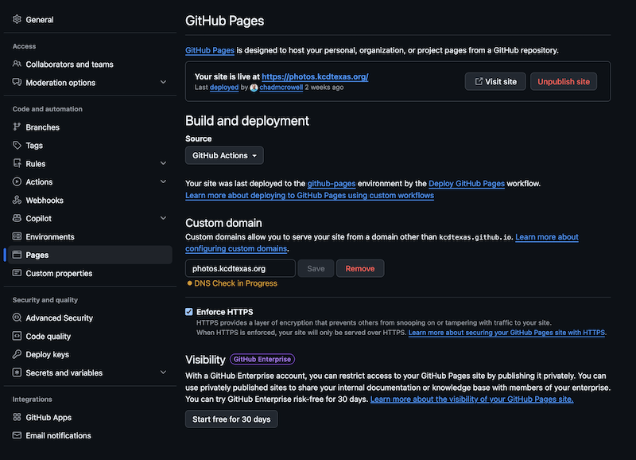
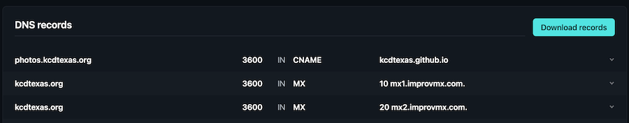

# Simple Event Photo Gallery Tutorial with GitHub Pages and GitHub Actions

This tutorial shows how to publish event photos on a simple public website using **GitHub Pages** for the site, **GitHub Actions** for deployment, and any **S3-compatible object storage** for the photo files. The goal is to keep the setup simple enough that other organizers can copy it without building a custom app or learning a complex platform.

## What this setup is

This approach uses three simple parts:

- **GitHub repository** named `photos`
- **GitHub Actions** to deploy the static site to GitHub Pages
- **S3-compatible object storage** to hold the photo files

The site itself is a static website, usually just HTML, CSS, and optional JavaScript. The images are not stored in GitHub. Instead, they are loaded from public object URLs in the storage bucket. This keeps the Git repo lightweight and avoids committing hundreds of large image files into Git.

## Why this approach was chosen

This workflow was chosen because it is:

- **Cheap**, since GitHub Pages is free for static sites and object storage is inexpensive.
- **Simple**, because there is no database, no app server, and no CMS to operate.
- **Portable**, because any S3-compatible object storage can serve the photos the same way.
- **Easy to hand off**, because the deployment logic lives in one small workflow file and the site can still remain a plain static site.

## Decisions behind this tutorial

To keep this easy for other teams to adopt, these choices were made:

- Use a GitHub repo named **`photos`**.
- Use **GitHub Actions** as the GitHub Pages source instead of branch-only publishing.
- Keep the website static and simple.
- Store photos in object storage, not in the Git repo.
- Make photo objects public for read access so they can be embedded directly by URL.
- Avoid unnecessary tooling unless it clearly makes the process easier.

This is not the most sophisticated gallery setup. It is one of the easiest to repeat.

## What you need before starting

Before starting, make sure you have:

- A GitHub organization or personal GitHub account
- A custom domain or subdomain, such as `photos.example.org`
- A bucket in any S3-compatible object storage
- Event photos ready to upload
- Permission to create DNS records for your domain

This tutorial assumes you already know how to create a bucket and upload photos into it.

## Architecture

The full setup looks like this:

1. Create a GitHub repo named `photos`
2. Add a basic static site to the repo
3. Create a GitHub Actions workflow YAML file for Pages deployment
4. Set the Pages source to **GitHub Actions**.
5. Add a custom domain such as `photos.example.org`.
6. Upload photos to object storage
7. Make photo objects public for read access.
8. Reference those photo URLs in the site

## Step 1: Create the GitHub repo

Create a new repository named **`photos`** in your GitHub organization or personal account.

Recommended settings:

- Repository name: `photos`
- Visibility: Public
- Initialize with a README: optional
- `.gitignore`: optional
- License: optional

Using the name `photos` makes the purpose obvious and pairs well with a subdomain such as `photos.example.org`.

## Step 2: Add a basic `index.html`

In the root of the repo, create a file named `index.html`.

Start with this minimal file:

```html
<!doctype html>
<html lang="en">
<head>
  <meta charset="utf-8">
  <meta name="viewport" content="width=device-width, initial-scale=1">
  <title>Event Photos</title>
  <style>
    body {
      margin: 0;
      font-family: Arial, sans-serif;
      background: #111;
      color: #fff;
    }
    header {
      padding: 16px;
    }
    .grid {
      display: grid;
      grid-template-columns: repeat(auto-fill, minmax(180px, 1fr));
      gap: 6px;
      padding: 0 16px 16px;
    }
    .grid img {
      width: 100%;
      height: auto;
      display: block;
    }
  </style>
</head>
<body>
  <header>
    <h1>Event Photos</h1>
    <p>Click any photo to view full size.</p>
  </header>
  <main class="grid">
    <a href="FULL_IMAGE_URL"></a>
  </main>
</body>
</html>
```

This file is intentionally basic. It proves the site works before adding the real gallery.

## Step 3: Create the GitHub Actions workflow folders

Inside the repo, create this folder structure:

```text
.github/workflows/
```

GitHub looks for workflow YAML files inside `.github/workflows/`. That is the standard location for repository automation, including GitHub Pages deployments.

## Step 4: Create the workflow YAML file

Inside `.github/workflows/`, create a file named `pages.yml`:

```yaml
name: Deploy GitHub Pages

on:
  push:
    branches: ["main"]
  workflow_dispatch:

permissions:
  contents: read
  pages: write
  id-token: write

concurrency:
  group: "pages"
  cancel-in-progress: true

jobs:
  deploy:
    environment:
      name: github-pages
      url: ${{ steps.deployment.outputs.page_url }}
    runs-on: ubuntu-latest
    steps:
      - name: Checkout
        uses: actions/checkout@v4

      - name: Setup Pages
        uses: actions/configure-pages@v5

      - name: Upload artifact
        uses: actions/upload-pages-artifact@v3
        with:
          path: .

      - name: Deploy to GitHub Pages
        id: deployment
        uses: actions/deploy-pages@v4

```

Your repo should now look something like this:

```text
photos/
├── index.html
└── .github/
    └── workflows/
        └── pages.yml
```

This `pages.yml` file is the GitHub Actions workflow that builds and deploys the site to GitHub Pages.

This workflow matches the standard GitHub Pages pattern: check out the repo, configure Pages, upload the site as a Pages artifact, and deploy it with `actions/deploy-pages`.

GitHub also notes that current Pages workflows should use `actions/upload-pages-artifact@v3` and `actions/deploy-pages@v4`.

## Step 5: Commit and push the files

Commit at least these files to the `main` branch:

- `index.html`
- `.github/workflows/pages.yml`

Then push to GitHub.

Once pushed, the workflow should appear in the **Actions** tab and begin deploying the site to GitHub Pages.

## Step 6: Enable GitHub Pages with GitHub Actions

In GitHub:

1. Open the `photos` repository
2. Click **Settings**
3. In the left sidebar, click **Pages**
4. Under **Build and deployment**, set **Source** to **GitHub Actions**.

GitHub’s documentation is explicit that when a site is deployed through a custom workflow, the Pages source should be **GitHub Actions**.

**EXAMPLE:**  


## Step 7: Wait for the workflow to finish

Go to the **Actions** tab and confirm the workflow succeeds.

A successful deployment means:

- the workflow checked out the repository
- the workflow uploaded the site as a Pages artifact.
- the workflow deployed it to the `github-pages` environment.

After that, GitHub Pages should show a default site URL.

## Step 8: Add the custom domain

Once the default Pages site is working:

1. Go to **Settings → Pages**
2. In **Custom domain**, enter the domain, for example:

```text
photos.example.org
```

**EXAMPLE:**  


3. Save the custom domain

GitHub Pages supports custom domains for repository-backed sites, including sites deployed through GitHub Actions.

## Step 9: Create the DNS record

In your DNS provider, create a **CNAME** record for the photo subdomain pointing to your GitHub Pages hostname.

Typical example:

- Host/Name: `photos`
- Type: `CNAME`
- Value/Target: `your-org.github.io`

Do not point the record to the GitHub repo URL like `github.com/your-org/photos`. The CNAME must point to the GitHub Pages hostname instead.

## Step 10: Wait for DNS validation and enable HTTPS

Return to **Settings → Pages** and wait for the DNS check to succeed. Then enable **Enforce HTTPS**.

At this point, the site should load from the custom domain.

## Step 11: Upload photos to object storage

Upload your event photos into a clean folder or prefix such as:

```text
public/2026/
```

Using a stable prefix makes it easier to organize albums, generate HTML, and repeat the same process next year.

## Step 12: Make the photos public

For the gallery to work, each image needs to be publicly readable by URL. This can be done with object ACLs or a bucket policy that allows `GetObject` access for the photo bucket or public prefix.

The simplest operational choice is to use a dedicated public photo bucket or a dedicated public prefix.

Important warning: if the bucket is public, only store public event photos in it.

## Step 13: Test direct image URLs

Before changing the site, test a few direct image URLs in a private browser window.

A typical object URL looks like this:

```text
https://bucket-name.provider-endpoint.example/public/2026/photo-001.jpg
```

If the raw object URL does not work directly, the GitHub Pages site will not be able to load it either.

## Step 14: Add photos to the gallery page

Once a test image works, update `index.html` to include more image links.

A single gallery item looks like this:

```html
<a href="https://bucket-name.provider-endpoint.example/public/2026/photo-001.jpg">
  
</a>
```

Repeat that pattern for all photos in the album.

For larger sets, it is easier to generate those repeated HTML lines from a list of object keys, but the final published site can still remain a simple static page.

## Step 15: Push updates and let GitHub Actions deploy

Whenever the site changes:

1. Edit `index.html` or any album page
2. Commit the changes to `main`
3. Push to GitHub
4. Let the Pages workflow deploy the updated site automatically.

This is one of the main benefits of the GitHub Actions approach: deployment becomes consistent and visible, and the team can see whether the publish step succeeded.

## Step 16: Test the finished gallery

Before sharing the gallery publicly, test these things:

- The homepage loads from the custom domain
- Images render in the grid
- Clicking a photo opens the full-size image
- The image can be downloaded in a normal browser flow
- The gallery works while logged out or in a private browser window

That final check matters because object storage permissions can appear to work in the console while still failing for normal visitors.

> NOTE: If you'd like to see this in use at KCD Texas, go to https://photos.kcdtexas.org and at the repo https://github.com/kcdtexas/photos

## Recommended simplicity rules

To keep this easy for other organizers to reuse, follow these rules:

- Keep the site static and straightforward
- Keep the photo files out of Git
- Use one small GitHub Actions workflow for deployment.
- Use a dedicated public photo bucket or public prefix
- Use stable folder naming such as `public/2026/`
- Avoid app servers, databases, or advanced gallery frameworks unless they are truly needed

These choices keep the setup understandable and easy to hand off.

## Tradeoffs to accept

This simple approach has some limits:

- It may not be the fastest possible gallery if full-size images are used directly in the grid
- It does not include advanced search, tagging, or album management
- It may require regenerating `index.html` when new photos are added
- It assumes the photos are meant for public download

Those tradeoffs are acceptable when the main goal is a low-maintenance, portable public event gallery.

## Optional improvements later

Once the simple version is working, teams can improve it without changing the architecture:

- Add smaller thumbnails for better performance.
- Add a lightweight lightbox.
- Generate the HTML gallery automatically from a list of object keys.
- Create multiple pages, such as one album per event or year

These are useful, but not required for a good first version.

## Reuse checklist

Use this checklist for each new event:

1. Confirm the `photos` repo still exists
2. Confirm GitHub Pages source is set to **GitHub Actions**.
3. Confirm `.github/workflows/pages.yml` is still present in the repo
4. Confirm the workflow is still green in **Actions**.
5. Confirm the custom domain still points to GitHub Pages.
6. Upload event photos to the public bucket or public prefix
7. Confirm direct image URLs work publicly.
8. Update `index.html` or album pages with the new gallery links
9. Commit and push to `main`
10. Confirm the Pages deployment succeeds
11. Test the site in a private browser window
12. Share the gallery link

## Final guidance

This pattern works because it separates responsibilities cleanly:

- GitHub Pages and GitHub Actions handle the website and deployment
- S3-compatible object storage handles the image files

That separation keeps the repo lightweight, makes the site easy to version in Git, and avoids turning a simple event photo gallery into a full software project.