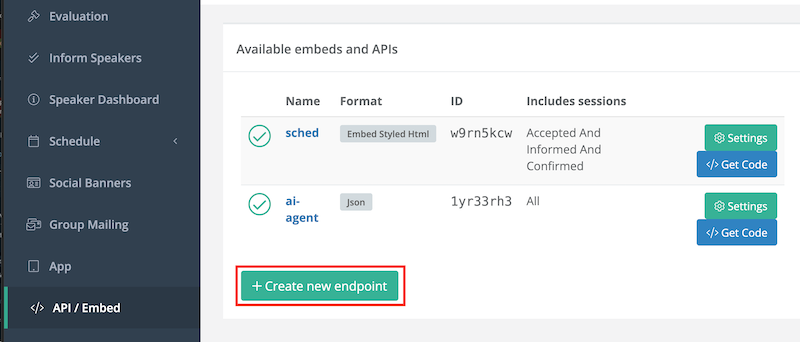
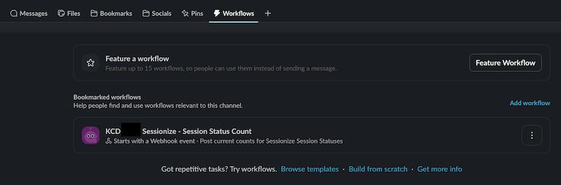

# Using Sessionize

As of 2024, we are using Sessionize as our official Call for Proposals platform. Please refer to [the Sessionize playbook for any help](https://sessionize.com/playbook/).

Also, [here is a guide](https://drive.google.com/file/d/1a9seYBhQgowlsbPzQNEFClOlvH8qXcgA/view?usp=sharing) KCD Organizer, and CNCF Ambassador, Michel Murabito created on how to building out a grid agenda.

---

## Sessionize CFP Status Notifications in Slack

Automatically post a session status summary to your organizing team's Slack channel so everyone can see at a glance how many talks are Nominated, Accepted, Declined, and more, without logging into Sessionize.

This workflow was first used by KCD Texas and can be replicated by any KCD with only a Sessionize event ID and a Slack workspace.

---

### Part 1: Get Your Sessionize API Endpoint

1. Open your Sessionize event dashboard and go to **API / Embed** in the right-side menu.
2. Click **Create a new endpoint**, select **JSON** as the format, and give it a name like `All Data`.
3. Click **Save**, then click the **`</> Get Code`** button.
4. Copy the **Session List** URL — it looks like:

   ```text
   https://sessionize.com/api/v2/<YOUR-EVENT-ID>/view/Sessions
   ```

   Keep this URL private; anyone who has it can read your event data.

> **Note:** By default, the Sessionize API only returns sessions with the status "Accepted and informed." To see sessions in all statuses (Nominated, Waitlisted, Accepted, Declined, etc.) you need to configure your endpoint to include all statuses. Check your endpoint settings in Sessionize to confirm this before wiring up your workflow.

For full details on the Sessionize API, see the [Sessionize API documentation](https://sessionize.com/playbook/api).



---

### Part 2: Build the Workflow in Slack Workflow Builder

Open Slack and navigate to **Workflows** (find it in the top menu bar in your KCD slack channel).



#### Step 1: Create a new workflow

1. Click **Create Workflow** and choose a **Scheduled** trigger.
2. Set a frequency (daily or every 6 hours works well) and a time that suits your team.
3. Name it something like **KCD [City] Sessionize - Session Status Count**.

#### Step 2: Fetch the Sessionize data

1. Click **Add Step** and choose **Web request** (the HTTP request step).
2. Set the method to **GET**.
3. Paste your Sessionize Session List URL from Part 1.

#### Step 3: Count sessions by status

The JSON response is an array of session objects. Each session has a status field that maps to one of six values:

| Status | Meaning |
| --- | --- |
| Nominated | Submitted and under review |
| Waitlisted | On the waitlist for a slot |
| Accept Queue | Awaiting acceptance decision |
| Accepted | Confirmed for the event |
| Decline Queue | Awaiting decline decision |
| Declined | Not selected |

Slack Workflow Builder has limited JSON parsing support. Use a **Code step** (JavaScript) if available in your plan, or see the alternative approach below if you need more flexibility.

A minimal JavaScript snippet to count statuses looks like this:

```js
const sessions = inputData.sessions; // the parsed JSON array from the previous step
const counts = {
  Nominated: 0,
  Waitlisted: 0,
  "Accept Queue": 0,
  Accepted: 0,
  "Decline Queue": 0,
  Declined: 0,
};

for (const session of sessions) {
  if (counts[session.status] !== undefined) {
    counts[session.status]++;
  }
}

output = counts;
```

#### Step 4: Send a message to your channel

1. Click **Add Step** and choose **Send a message**.
2. Select your organizing team's channel.
3. Format the message using the variables from the previous step:

```text
KCD [City] Sessionize - Session Status Count

Nominated: {{nominated}}
Waitlisted: {{waitlisted}}
Accept Queue: {{accept_queue}}
Accepted: {{accepted}}
Decline Queue: {{decline_queue}}
Declined: {{declined}}
```

1. Optionally, add a direct link to your Sessionize event dashboard at the bottom so organizers can jump in immediately.

#### Step 5: Publish and test

1. Click **Publish** to activate the workflow.
2. Use the **Run** button to trigger it manually and confirm the message appears in your channel with correct counts.

---

### Alternative: Route Through an External Automation Tool

Slack Workflow Builder's native JSON support is limited on some plans. If you hit a wall, route the logic through **Zapier**, **Make (formerly Integromat)**, or a simple cron script instead.

1. In Slack Workflow Builder, create a workflow triggered **by a webhook**. Slack generates a unique inbound webhook URL for you.
2. In your external tool, set up a scheduled trigger that:
   - Fetches your Sessionize Session List URL
   - Parses the JSON and counts each status
   - POSTs the counts as variables to your Slack webhook URL
3. In Slack Workflow Builder, add a **Send a message** step that uses those incoming variables to format and post the summary.

This approach gives you full control over the parsing and counting logic and works regardless of your Slack plan.

---

### Why This Helps KCD Organizers

- **Visibility without logging in** — your whole team sees CFP status at a glance in the channel where they already work.
- **Timely decisions** — when Nominated counts are high you know you need more reviewers; when Accept Queue grows you know decisions are pending.
- **Easy to replicate** — once one KCD sets this up, any other KCD can copy the workflow and swap in their own Sessionize event ID.
